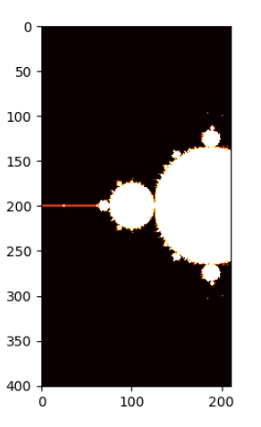

# Mandelbrot Set Generator

The Mandelbrot Set Generator is a Python project that allows users to generate and visualize the intricate and beautiful fractal patterns of the Mandelbrot Set. This project leverages Python's computational and graphical capabilities to render high-resolution images of this fascinating mathematical set.

## Features

- **High-Resolution Visualization:** Generate detailed images of the Mandelbrot Set.
- **Customizable Parameters:** Adjust parameters like the maximum number of iterations and region of interest.
- **Color Mapping:** Visualize the Mandelbrot Set using different color schemes.
- **Save and Export:** Save generated fractal images as PNG files.

## Requirements

- Python 3.6 or higher
- NumPy
- Matplotlib
- Pillow

 

